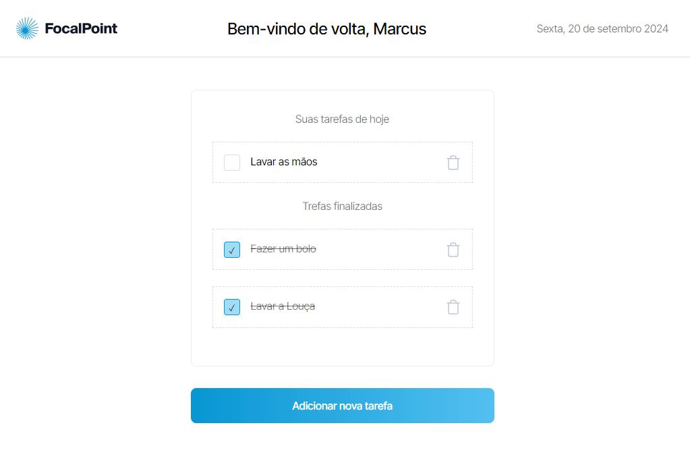
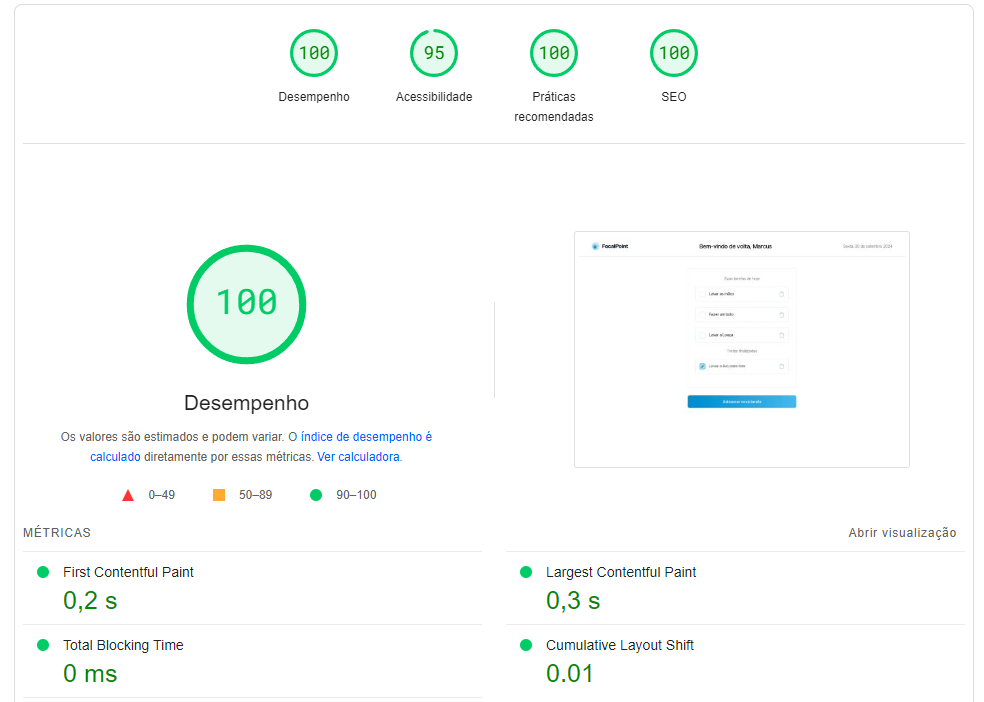

# Legaplan Teste Dev Junior

Este é um projeto desenvolvido como parte do teste de front-end da Legaplan, que consiste em criar uma todo-list.

[](https://legaplan-frontend-teste.vercel.app/)

[https://legaplan-frontend-teste.vercel.app/](https://legaplan-frontend-teste.vercel.app/)

## Tecnologias Utilizadas

- **Next.js**: Framework para React que oferece suporte a renderização no lado do servidor (SSR) e geração de sites estáticos (SSG).
- **TypeScript**: Utilizado para adicionar tipagem estática ao projeto, facilitando a manutenção e prevenindo erros.
- **SCSS**: Pré-processador CSS utilizado para organizar e reutilizar estilos de forma mais eficiente.
- **Vercel**: Plataforma de deploy para Next.js, facilitando o deploy contínuo e escalável.

## Funcionalidades

- **Exibição das Tasks**: A página inicial exibe todas as tasks do usuário.
- **Manipulação de Tasks**: O Usuário consegue tanto como criar, deletar e "concluir" uma task.
- **localStorage**: Os estados ficam armazenados dentro do localStorage, portanto se o usuário fechar sem querer a página os dados continuam salvos
- **Context API**: Os estados das tasks são armazenados em um contexto global
- **Responsividade**: O layout é totalmente responsivo, adaptando-se a diferentes dispositivos e tamanhos de tela, utilizando SCSS para controlar o design adaptativo.

## Desempenho

[](https://pagespeed.web.dev/analysis/https-legaplan-frontend-teste-vercel-app/y8bp9pot4k?form_factor=desktop&category=performance&category=accessibility&category=best-practices&category=seo&hl=pt&utm_source=lh-chrome-ext)

[lighHouse](https://pagespeed.web.dev/analysis/https-legaplan-frontend-teste-vercel-app/y8bp9pot4k?form_factor=desktop&category=performance&category=accessibility&category=best-practices&category=seo&hl=pt&utm_source=lh-chrome-ext)

## Instalação e Execução

Para rodar o projeto localmente com **Next.js**, siga os passos abaixo:

### Pré-requisitos:

- **npm** ou **yarn** como gerenciador de pacotes

### Passos:

1. Clone o repositório:

   ```bash
   git clone https://github.com/gabrielneoob/legaplan-frontend-teste.git

2. Navegue até o diretório do projeto:

   ```bash
   cd legaplan-frontend-teste

3. Instale as dependências:

   ```bash
   npm install

4. Execute o projeto:

   ```bash
   npm run dev
